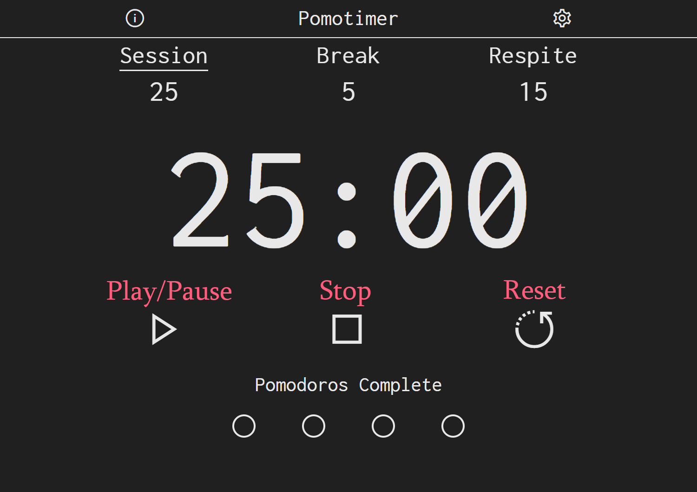

<h1 align="center">Pomotimer</h1>

<h4 align="center">Minimalist Pomodoro timer with customizable session/break times and colors.</h4>

<h2 align="center">
    <a href="https://pomotimer.com">DEMO</a>
<h2>

# What is the Pomodoro Technique

The [*Pomodoro Technique*](https://en.wikipedia.org/wiki/Pomodoro_Technique) is a method to manage work time through work and break intervals. Traditionally, the timer goes through four sessions of work (25 minutes), three short breaks (5 minutes), and one long break (15 minutes). One pomodoro equals one complete work session. After a work session a short break starts, and after four pomodoros are complete, a long break starts. After that, the timer restarts fresh to the beginning with no pomodoros complete, restarting the cycle. Its purpose is to build discipline by
enforcing sessions of work with no distractions and breaks to relax before continuing with work.

## How To Use

### Time Options

1. Session - Work time. One finished session equals one complete pomodoro.
2. Break - Short break before continuing with another session.
3. Respite - Long break after four sessions (pomodoros) are complete.

### Controls

1. Play/Pause - Play or pause the timer.
2. Stop - Reset the currently selected time (this will not reset any pomodoros).
3. Reset - Reset the timer, including all pomodoros.

### Time Length

Change time length in the settings.

### Keyboard Shortcuts

* **Controls**
  * SPACE - Play/Pause
  * ALT + S - Stop (current time reset)
  * ALT + R - Reset (current time & pomodoros reset)
* **Time Options**
  * ALT + P - Session
  * ALT + B - Break
  * ALT + L - Respite

## Gulp Tasks

    Run tasks with "npx gulp", e.g. "npx gulp build"

* **Development**
  * concat - Concatenate all scripts and stylesheets
  * copy - Copy all needed files
  * build - concat + copy
  * cleanAll - Remove all files from dist, excluding .git and CNAME
  * cleanVendor - Remove all files from vendor
  * default - cleanAll + build
  * watch - Watch all HTML, CSS, and JavaScript files for changes. On change, runs default.
* **Production**
  * concatProduction - Same as development, except with scripts and vendor scripts wrapped in a self-executing function.
  * buildProduction - concatProduction + copy
  * production - cleanAll + buildProduction

## Features

* Customizable Times - From one minute up to one hundred hours.
* Pre-built Color Themes - Choose from a variety of hand-picked themes.
* Custom Themes - Make a theme with any colors you want!
* Keyboard Shortcuts - For faster use.
* Preferences - Customize the timer in the settings menu.
* Notifications - Get alerted when a time session finishes.
* Local Storage - All preferences are saved locally.

## Tech

* [Express](https://expressjs.com/) - Simple web server to serve static files.
* [Gulp](https://gulpjs.com/) - Streaming build system. Automates concatenating and minifying files.
* [Spectrum](https://bgrins.github.io/spectrum/) - Color picker used to make a custom theme.
* [jQuery](https://jquery.com/) - Serves up spectrum.

The majority of the core application is made in vanilla HTML, CSS, and JavaScript.

## License

[MIT](LICENSE)
